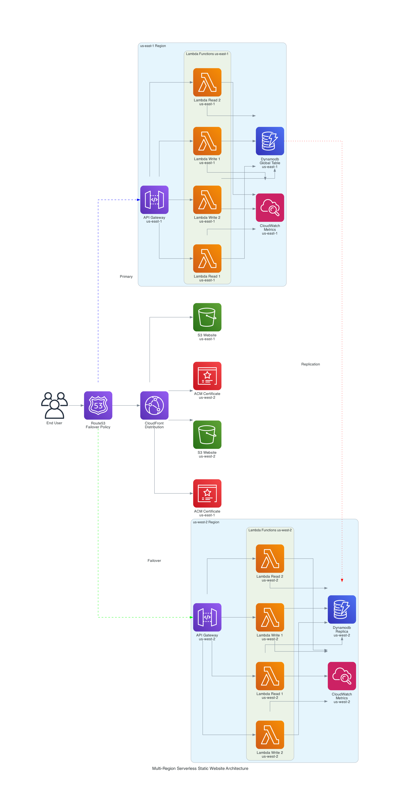

# Serverless Multi-Region Static Website on AWS

## Overview

This project demonstrates a **highly available, disaster-resilient serverless web application** on AWS. The architecture leverages AWS managed services to provide global redundancy, automatic failover, and seamless scaling.

---

## Architecture

- **Frontend:**  
    - Static website hosted in **S3** buckets in both us-east-1 and us-west-2.
    - Distributed globally via a single **CloudFront** distribution.

- **Backend:**  
    - **API Gateway** in each region (us-east-1 and us-west-2) exposes REST endpoints (GET and POST).
    - Each API Gateway connects to four Lambda functions per region:
        - 2 Read Lambdas (fetch data from DynamoDB)
        - 2 Write Lambdas (write data to DynamoDB)
    - **DynamoDB Global Table** with primary in us-east-1 and replica in us-west-2.

- **Domain and Routing:**  
    - **Custom domain** managed in **Route 53**.
    - **Failover routing policy**: Route 53 directs traffic to the primary region (us-east-1) and automatically fails over to the secondary (us-west-2) if needed.
    - Route 53 targets the two API Gateway instances.

- **Security:**  
    - **ACM certificates** are provisioned in both regions for HTTPS support.

- **Monitoring:**  
    - **CloudWatch Dashboards** monitor Lambda read and write metrics in both regions.

---

## Features

- Multi-region S3 static website hosting
- Global DynamoDB table for cross-region data replication
- API Gateway with failover and dual-region endpoints
- Multiple Lambda functions for scalable backend compute
- Route 53 DNS failover for high availability
- CloudFront for fast, secure, global content delivery
- ACM for SSL/TLS certificates in both regions
- CloudWatch for real-time monitoring and metrics

---

## Deployment Steps

1. Clone this repository and configure your AWS credentials.

2. Update variables in terraform.tfvars or as needed for your domain and bucket names.

3. Initialize Terraform first in ```remote_backend``` then ```serverless_app``` va below steps:
     ```sh
     terraform init
     ```

4. Review the plan:
     ```sh
     terraform plan
     ```

5. Apply the configuration:
     ```sh
     terraform apply
     ```

---

## Access

- The website will be available at your custom domain (for example, https://www.yourdomain.com), served via CloudFront.
- API endpoints are accessible via the same domain, routed to the appropriate region by Route 53.

---

## Monitoring

- View Lambda metrics (invocations, errors, duration) in the CloudWatch dashboards for both regions.

---

## Notes

- Ensure ACM certificates are validated in both regions before deploying API Gateway custom domains.
- Make sure your Route 53 health checks and failover policies are correctly configured for seamless failover.
- Keep both S3 buckets in sync for consistent website content.

---



Diagram showing a multi-region AWS serverless static website architecture. End users access the site through Route 53 with a failover policy, which directs traffic to a CloudFront distribution. CloudFront serves static content from S3 buckets in us-east-1 and us-west-2, each with its own ACM certificate. API requests are routed to API Gateway in the primary region us-east-1, which connects to four Lambda functions (two read, two write) and a DynamoDB global table. CloudWatch monitors Lambda metrics. If the primary region fails, Route 53 directs traffic to the secondary region us-west-2, which has a similar setup with its own API Gateway, Lambda functions, DynamoDB replica, and CloudWatch monitoring. The diagram includes labels for primary, failover, and replication flows, and shows all major AWS services involved. The environment is technical and organized, with a focus on high availability and disaster recovery. Text in the image includes service names, region labels, and architecture flow descriptions.